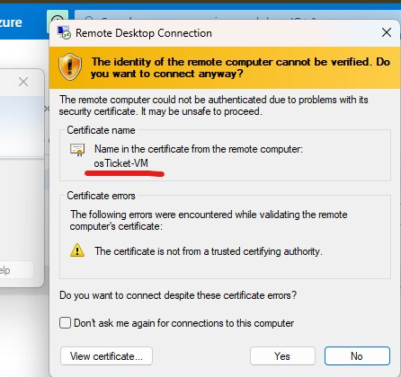
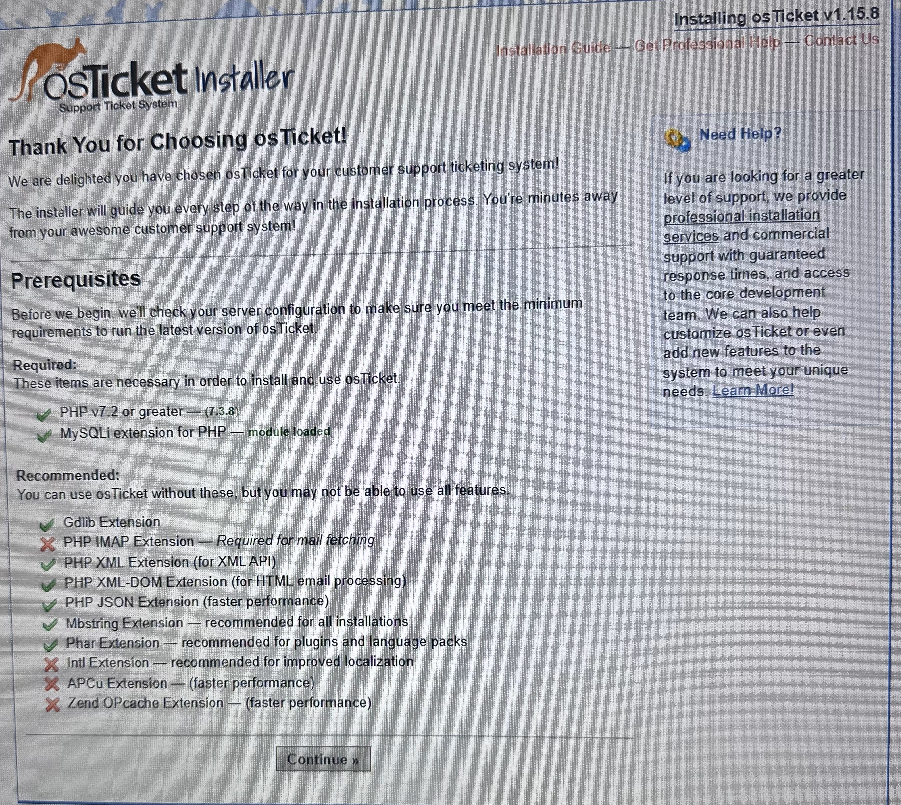

<h1>osTicket - Installation</h1>
osTicket is an open-source support ticket system that helps organizations manage customer service requests and support tickets. It provides a reliable platform for tracking and resolving customer issues. In this tutorial, I will demonstrate and outline the steps to install the osTicket help desk ticketing system. To ensure it works perfectly, we need to install and configure several components, including a web server, a database and other necessary requirements.
 

<h2>Environments and Technologies Used</h2>

- Microsoft Azure (Virtual Machines/Compute)
- Remote Desktop
- Internet Information Services (IIS)

<h2>Operating Systems Used </h2>

- Windows 10</b> (22H2)

<!-- <h2>List of Prerequisites</h2>

- Web Server
- Item 2
- Item 3
- Item 4
- Item 5

"C:\Users\esrom\iCloudDrive\Desktop\GITHUB PORJECT\Profile\Insatall osTicket.png"
-->

<h2>Installation Steps</h2>

<h4>Virtual Machine</h4>

  

<!--I created the RG(Resourse Group) first and went on to create the VM. So the RG is just a container that holds related resources, like VM or other applications. When creating the VM, it'll ask for a Login credentials to be created. When that's completed it's advised to write down or memorize them because that's what's used to login to RDP.-->

I created a Virtual Machine (VM) with 4 vCPUs to ensure optimal performance during the installation and subsequent operation of the system. Then, I created a Resource Group to organize and manage the VM and its associated resources efficiently. After setting up the VM, I logged into it using Remote Desktop to begin the installation process.
 

 

<h4>Instlation</h4>

<h5>PHP</h5>  
 
<h5>Rewrite</h5>  

<h5>Visual C++</h5>  

<h5>MySQL</h5>

Before starting the installation process, I enabled IIS (Internet Information Services) and installed CGI (Common Gateway Interface). A brief description of IIS, is it's a web server that runs on Windows and is used to host applications, and services, like osTicket. And CGI on the other hand, allows the server to run external applications to generate dynamic content for web pages. After finishing that, I began installing the required components. I started with PHP Manager for IIS, as PHP is a backend web server language and is required for osTicket to function properly. Next, I installed the Rewrite module, which is also necessary. Then, I moved on to installing Microsoft Visual C++ Redistributable. This is needed because osTicket may rely on certain C++ components provided by it. Without this, some components might fail to run, leading to issues with osTicket’s functionality, especially on Windows servers. Finally, I installed MySQL, which is the database that osTicket uses to store all its data.

 

<h4>Instlation Continue</h4>

Using PHP manager and IIS I was able to rgegister PHP so the server knows that PHP exist in the computer. Then I move on to begain my instalation of osTicket by first starting to extarct all the osTicket files, then opened the extracted file and moved it into a new folder. Then Got to this page
  and if I'm guessing it's some kinda pre-check, that shows what's not required but recommended(pls correct or modify). So I went back and used IIS to fix or enable the problem. Before the installation I filled out the required field of basic info(not using real names) but the last part about the database settings field is another database(by another meaning, a backend database has been created already) by actually loging into the backend database and creating another one just for osTicket then provide the credentials for it. So I went ahead and installed 'HeidiSQL' which is an application that allows to make connection into the database. Now that's done, we can continue 

 

